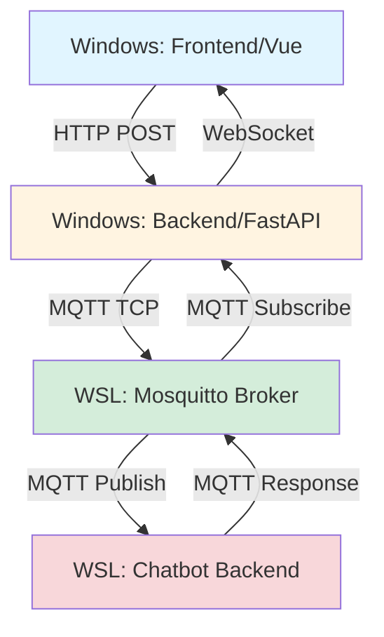
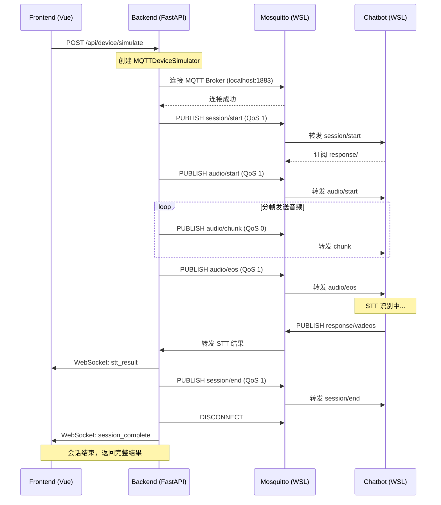

# MQTT 设备模拟功能说明

## 🎯 功能概述

STT 测试平台提供**真实的 MQTT 设备模拟**功能，通过标准 MQTT 协议与 chatbot 后端进行通信，完整模拟真实设备的会话生命周期。

**关键特性**：
- ✅ **真实 MQTT 调用**：不是模拟，是真实的 MQTT 协议通信
- ✅ **完整会话流程**：session/start → audio/start → chunks → audio/eos → session/end
- ✅ **实时反馈**：通过 WebSocket 推送 MQTT 消息日志和 STT 结果
- ✅ **多设备并发**：支持最多 10 个设备同时模拟
- ✅ **结构化结果**：记录完整的测试结果（STT 文本、耗时、chunk 数等）

---

## 📊 架构设计

### 整体架构



### 组件说明

| 组件 | 运行位置 | 作用 |
|------|----------|------|
| **Frontend** | Windows | Vue 3 前端，用户界面 |
| **Backend** | Windows | FastAPI 后端，MQTT 模拟器管理 |
| **Mosquitto** | WSL | MQTT Broker，消息路由 |
| **Chatbot** | WSL | chatbot 后端，STT/TTS 处理 |

---

## 🔄 完整调用流程

### 时序图



### 详细步骤

#### 1. 前端发起模拟请求

```typescript
// frontend/src/composables/useMQTTSimulation.ts
async function startSimulation(config: SimulationConfig) {
  const resp = await axios.post('/api/device/simulate', {
    device_id: config.deviceId,
    figurine_id: config.figurineId,
    mode: config.mode,
    audio_id: config.audioId,
    test_type: 'mqtt',
    subscribe_response: true,
  })
  
  state.sessionId = resp.data.session_id
  // 连接 WebSocket 接收实时反馈
  ws = new WebSocket(`ws://${window.location.host}/ws/session/${state.sessionId}`)
}
```

#### 2. 后端创建模拟器

```python
# backend/server.py
@app.post("/api/device/simulate")
def start_device_simulation(req: SimulateRequest):
    session_id = simulation_manager.start_simulation(
        device_id=req.device_id,
        figurine_id=req.figurine_id,
        mode=req.mode,
        audio_id=req.audio_id,
        resolve_audio=_resolve_audio_for_sim,
        subscribe_response=req.subscribe_response,
    )
    return {"session_id": session_id, "status": "started"}
```

#### 3. MQTT 会话生命周期

```python
# backend/mqtt_bridge.py - MQTTDeviceSimulator.simulate_from_wav()

# Step 1: 连接 MQTT Broker
self._connect()  # localhost:1883

# Step 2: 发布 session/start
self._publish_session_start()
# Topic: devices/{device_id}/session/start
# Payload: {"session_id": "...", "character": "...", "mode": "dialogue"}

# Step 3: 发布 audio/start
self._publish_audio_start()
# Topic: devices/{device_id}/audio/start
# Payload: {"format": "pcm", "sample_rate": 16000, "channels": 1}

# Step 4: 分帧发送音频 chunk
total_chunks = self._publish_audio_chunks(pcm_data)
# Topic: devices/{device_id}/audio/chunk
# Payload: Base64 编码的 PCM 数据
# QoS: 0（不保证送达，追求速度）

# Step 5: 发布 audio/eos（音频结束）
self._publish_audio_eos(total_chunks, duration_ms)
# Topic: devices/{device_id}/audio/eos
# Payload: {"total_seq": N, "duration_ms": M}

# Step 6: 等待 chatbot 处理
time.sleep(wait_time)  # 根据音频时长动态计算

# Step 7: 发布 session/end
self._publish_session_end()
# Topic: devices/{device_id}/session/end
# Payload: {"reason": "user_stop"}

# Step 8: 断开连接
self._disconnect()
```

#### 4. 接收 chatbot 响应

```python
# backend/mqtt_bridge.py - _on_message()

def _on_message(self, client, userdata, msg):
    """收到服务端下行响应"""
    resp_type, meta = self._parse_response_topic(msg.topic)
    parsed = json.loads(msg.payload.decode("utf-8"))
    
    if resp_type == "vadeos":
        # STT 识别结果
        text = parsed.get("text", "")
        self.result.stt_text = text
        self.result.stt_confidence = parsed.get("confidence", 0.0)
        
        # 通过 WebSocket 推送给前端
        self._emit("stt_result", {
            "text": text,
            "confidence": self.result.stt_confidence,
        })
    
    elif resp_type == "audio_chunk":
        # TTS 音频块
        self.result.tts_chunks += 1
```

#### 5. WebSocket 实时推送

```python
# backend/server.py - WebSocket 端点

@app.websocket("/ws/session/{session_id}")
async def websocket_endpoint(websocket: WebSocket, session_id: str):
    await websocket.accept()
    
    # 从事件总线订阅该 session 的事件
    event_bus = simulation_manager.event_bus
    queue = event_bus.subscribe(session_id)
    
    try:
        while True:
            event = await asyncio.get_event_loop().run_in_executor(None, queue.get)
            await websocket.send_json(event)
            
            if event.get("type") == "session_closed":
                break
    finally:
        event_bus.unsubscribe(session_id)
```

---

## 📝 MQTT 消息格式

### 上行消息（设备 → chatbot）

#### session/start

```json
{
  "topic": "devices/{device_id}/session/start",
  "qos": 1,
  "payload": {
    "session_id": "Yy67zbmVnzqo",
    "character": "roman_centurion",
    "mode": "dialogue",
    "nfc_id": "sim-nfc"
  }
}
```

#### audio/start

```json
{
  "topic": "devices/{device_id}/audio/start",
  "qos": 1,
  "payload": {
    "format": "pcm",
    "sample_rate": 16000,
    "channels": 1,
    "bits_per_sample": 16
  }
}
```

#### audio/chunk

```json
{
  "topic": "devices/{device_id}/audio/chunk",
  "qos": 0,
  "payload": {
    "seq": 1,
    "data": "Base64EncodedPCMData..."
  }
}
```

#### audio/eos

```json
{
  "topic": "devices/{device_id}/audio/eos",
  "qos": 1,
  "payload": {
    "total_seq": 150,
    "duration_ms": 3000
  }
}
```

#### session/end

```json
{
  "topic": "devices/{device_id}/session/end",
  "qos": 1,
  "payload": {
    "reason": "user_stop"
  }
}
```

### 下行消息（chatbot → 设备）

#### response/vadeos（STT 结果）

```json
{
  "topic": "devices/{device_id}/response/vadeos",
  "payload": {
    "text": "你好世界",
    "confidence": 0.95,
    "language": "zh-CN",
    "duration_ms": 3000
  }
}
```

#### response/audio_start（TTS 开始）

```json
{
  "topic": "devices/{device_id}/response/audio_start",
  "payload": {
    "format": "pcm",
    "sample_rate": 24000
  }
}
```

#### response/audio_chunk（TTS 音频块）

```json
{
  "topic": "devices/{device_id}/response/audio_chunk",
  "payload": {
    "seq": 1,
    "data": "Base64EncodedPCMData..."
  }
}
```

#### response/audio_eos（TTS 结束）

```json
{
  "topic": "devices/{device_id}/response/audio_eos",
  "payload": {
    "duration_ms": 2500
  }
}
```

---

## 🔧 配置说明

### 环境变量

```bash
# .env 文件

# MQTT Broker 配置
MQTT_HOST=localhost          # WSL 中的 Mosquitto 地址
MQTT_PORT=1883               # MQTT 端口
MQTT_ENV=development         # 环境标识

# MySQL 配置（用于查询角色和音频）
MYSQL_HOST=192.168.52.134    # WSL IP（Windows 访问）
MYSQL_USER=chatbot
MYSQL_PASSWORD=chatbot123
MYSQL_DATABASE=ZebbieDb
```

### 最大并发数

```python
# backend/mqtt_bridge.py
class SimulationManager:
    MAX_DEVICES = 10  # 最多同时模拟 10 个设备
```

---

## 📊 测试结果结构

```python
@dataclass
class SimulationResult:
    session_id: str
    device_id: str
    figurine_id: str
    mode: str
    audio_id: str
    
    # 输入音频信息
    audio_duration_sec: float      # 音频时长（秒）
    total_chunks: int              # 发送的 chunk 数量
    
    # 耗时统计
    started_at: float              # 开始时间戳
    completed_at: float            # 完成时间戳
    send_duration_sec: float       # 总耗时（秒）
    
    # STT 结果
    stt_text: str                  # 识别文本
    stt_confidence: float          # 置信度
    stt_language: str              # 语言代码
    
    # TTS 响应统计
    tts_response_count: int        # TTS 响应次数
    tts_chunks: int                # TTS 音频块数量
    tts_duration_ms: int           # TTS 音频时长（毫秒）
    
    # 状态
    status: str                    # pending/active/completed/error
    error: str                     # 错误信息（如果有）
    
    # 详细日志
    backend_responses: list        # 所有后端响应记录
```

---

## 🧪 使用示例

### 前端调用

```typescript
import { useMQTTSimulation } from '../composables/useMQTTSimulation'

const { startSimulation, logs, sttResult } = useMQTTSimulation()

// 启动模拟
await startSimulation({
  deviceId: 'sim-dev-abc123',
  figurineId: 'roman_centurion',
  mode: 'dialogue',
  audioId: 'tts/123',  // 或 'model/test.wav'
})

// 监听日志
watch(logs, (newLogs) => {
  console.log('MQTT 消息:', newLogs[newLogs.length - 1])
})

// 获取 STT 结果
watch(sttResult, (result) => {
  if (result) {
    console.log('识别文本:', result.text)
    console.log('置信度:', result.confidence)
  }
})
```

### 后端 API

```bash
# 启动模拟
curl -X POST http://localhost:8765/api/device/simulate \
  -H "Content-Type: application/json" \
  -d '{
    "device_id": "sim-dev-001",
    "figurine_id": "roman_centurion",
    "mode": "dialogue",
    "audio_id": "tts/123",
    "subscribe_response": true
  }'

# 查询结果
curl http://localhost:8765/api/device/result/{session_id}

# 查询历史
curl http://localhost:8765/api/device/history?limit=10&offset=0
```

---

## 🎯 关键技术点

### 1. 真实 MQTT 通信

- **不是模拟**：使用 `paho-mqtt` 库真实连接 Mosquitto Broker
- **标准协议**：完全遵循 MQTT v3.1.1 协议规范
- **QoS 支持**：session 消息使用 QoS 1（保证送达），chunk 使用 QoS 0（追求速度）

### 2. 异步事件驱动

- **后台线程**：每个模拟在独立线程中运行，不阻塞主线程
- **事件总线**：通过 `EventBus` 实现跨线程通信
- **WebSocket 推送**：实时向前端推送 MQTT 消息和 STT 结果

### 3. 音频处理

- **WAV 转 PCM**：自动将 WAV 文件转换为 16kHz 单声道 PCM
- **分帧编码**：按 160ms 帧长切分音频（2560 samples）
- **Base64 编码**：PCM 数据通过 Base64 编码传输

### 4. 并发控制

- **线程安全**：使用 `threading.Lock` 保护共享状态
- **资源限制**：最多 10 个并发模拟，防止资源耗尽
- **优雅停止**：支持手动停止正在运行的模拟

---

## 🐛 常见问题

### Q1: MQTT 连接失败

**现象**：`MQTT 连接失败: [Errno 111] Connection refused`

**原因**：Mosquitto 服务未启动

**解决**：
```bash
wsl
sudo service mosquitto start
```

### Q2: 音频未缓存

**现象**：`音频未缓存: tts/123`

**原因**：TTS 生成的音频未保存到本地文件系统

**解决**：
- 确保生成音频时勾选"保存到数据库"
- 或检查 `CACHE_DIR` 配置是否正确

### Q3: WebSocket 连接断开

**现象**：前端收不到实时反馈

**原因**：WebSocket 连接超时或网络问题

**解决**：
- 检查浏览器控制台是否有 WebSocket 错误
- 确认后端 WebSocket 端点正常运行
- 尝试刷新页面重新连接

---

## 📚 相关文档

- [CONVERSATION_AUDIO_TRACKING.md](./CONVERSATION_AUDIO_TRACKING.md) - 对话音频追踪功能
- [PRIVACY_PROTECTION.md](./PRIVACY_PROTECTION.md) - 隐私保护方案
- [IMPLEMENTATION_SUMMARY.md](./IMPLEMENTATION_SUMMARY.md) - 实施总结

---

## 🚀 未来优化方向

### 阶段 1：基础功能完善（当前）

✅ **已实现**：
- 真实 MQTT 协议通信
- 完整会话生命周期模拟
- WebSocket 实时反馈
- 结构化测试结果

🎯 **待优化**：
- 支持更大的并发数（当前 10 个）
- 优化音频分帧算法，减少延迟
- 添加 VAD（语音活动检测）模拟
- 支持多种音频格式（MP3、OGG）

---

### 阶段 2：深度集成 chatbot 源码（后期设计）

#### 🎯 核心目标

**实现真正的「白盒测试」**：测试平台不再是外部模拟器，而是直接嵌入 chatbot 后端，监控完整的处理链路。

#### 📊 架构对比

**当前架构（黑盒测试）**：
```
Frontend → Backend (MQTT Simulator) → Mosquitto → Chatbot Backend
                                    ↑
                              外部调用，无法监控内部流程
```

**目标架构（白盒测试）**：
```
Frontend → Test Platform Backend (Hook Layer)
                                    ↓
                          Chatbot Backend (Instrumented)
                                    ↓
                        [STT] → [LLM] → [TTS] → [Response]
                                    ↑
                          每个环节都有监控点
```

#### 🔧 技术实现方案

##### 1. 配置化映射机制

创建 `chatbot_mapping.yaml` 配置文件，定义 chatbot 后端的完整处理链路：

```yaml
# config/chatbot_mapping.yaml

# STT 处理链路
stt_pipeline:
  entry_point: "src/processors/asr/asr_factory.py::load_offline_recognizer"
  steps:
    - name: "audio_preprocess"
      hook: "src/processors/asr/preprocessor.py::normalize_audio"
      metrics:
        - "duration_ms"
        - "sample_rate"
        - "channels"
    
    - name: "vad_detection"
      hook: "src/processors/asr/vad.py::detect_speech"
      metrics:
        - "speech_segments"
        - "silence_ratio"
    
    - name: "asr_inference"
      hook: "src/processors/asr/paraformer.py::transcribe"
      metrics:
        - "inference_time_ms"
        - "rtf"
        - "confidence"
    
    - name: "post_process"
      hook: "src/processors/asr/postprocessor.py::clean_text"
      metrics:
        - "original_length"
        - "cleaned_length"

# LLM 处理链路
llm_pipeline:
  entry_point: "src/processors/llm/llm_processor.py::generate_response"
  steps:
    - name: "prompt_construction"
      hook: "src/processors/llm/prompt_builder.py::build_context"
      metrics:
        - "context_tokens"
        - "history_length"
    
    - name: "llm_inference"
      hook: "src/processors/llm/openai_client.py::chat_completion"
      metrics:
        - "prompt_tokens"
        - "completion_tokens"
        - "total_tokens"
        - "latency_ms"
    
    - name: "response_validation"
      hook: "src/moderation/content_filter.py::validate"
      metrics:
        - "blocked": false
        - "flags": []

# TTS 处理链路
tts_pipeline:
  entry_point: "src/processors/tts/tts_service.py::synthesize"
  steps:
    - name: "voice_selection"
      hook: "src/processors/tts/voice_manager.py::select_voice"
      metrics:
        - "voice_id"
        - "gender"
        - "personality"
    
    - name: "text_normalization"
      hook: "src/processors/tts/text_processor.py::normalize"
      metrics:
        - "original_text"
        - "normalized_text"
    
    - name: "audio_synthesis"
      hook: "src/processors/tts/minimax_api.py::generate_audio"
      metrics:
        - "synthesis_time_ms"
        - "audio_duration_ms"
        - "file_size_bytes"
```

##### 2. Hook 注入机制

通过 Python 装饰器或 Monkey Patching，在 chatbot 源码的关键位置插入监控代码：

```python
# src/hooks/instrumentation.py

import time
import functools
from typing import Callable, Any

class MetricCollector:
    """指标收集器"""
    
    def __init__(self):
        self.metrics = {}
    
    def record(self, step_name: str, metric_name: str, value: Any):
        if step_name not in self.metrics:
            self.metrics[step_name] = {}
        self.metrics[step_name][metric_name] = value

# 全局收集器
collector = MetricCollector()

def instrument(step_name: str):
    """装饰器：自动记录函数执行时间和指标"""
    def decorator(func: Callable):
        @functools.wraps(func)
        def wrapper(*args, **kwargs):
            start_time = time.time()
            
            # 执行原函数
            result = func(*args, **kwargs)
            
            # 记录耗时
            duration_ms = (time.time() - start_time) * 1000
            collector.record(step_name, "duration_ms", duration_ms)
            
            # 记录额外指标（如果函数返回字典）
            if isinstance(result, dict):
                for key, value in result.items():
                    if key.endswith("_ms") or key.endswith("_sec"):
                        collector.record(step_name, key, value)
            
            return result
        return wrapper
    return decorator

# 使用示例
@instrument("asr_inference")
def transcribe(audio_data: bytes) -> dict:
    # ... 原始代码 ...
    return {"text": "你好", "confidence": 0.95}
```

##### 3. 实时监控 WebSocket

测试平台后端通过 WebSocket 实时推送每个步骤的指标：

```python
# backend/instrumentation_server.py

import asyncio
from fastapi import WebSocket

@app.websocket("/ws/instrumentation/{session_id}")
async def instrumentation_ws(websocket: WebSocket, session_id: str):
    await websocket.accept()
    
    # 订阅指标收集器
    while True:
        # 从 collector 获取最新指标
        metrics = collector.get_latest_metrics()
        
        # 推送到前端
        await websocket.send_json({
            "type": "pipeline_metrics",
            "session_id": session_id,
            "timestamp": time.time(),
            "metrics": metrics,
        })
        
        await asyncio.sleep(0.1)  # 100ms 刷新率
```

##### 4. 前端可视化

前端展示完整的处理链路和实时指标：

```vue
<!-- frontend/components/PipelineVisualizer.vue -->

<template>
  <div class="pipeline">
    <!-- STT 链路 -->
    <div class="stage stt">
      <h3>🎤 STT 处理</h3>
      <div v-for="step in sttSteps" :key="step.name" class="step">
        <span class="name">{{ step.name }}</span>
        <span class="metric">{{ step.duration_ms }}ms</span>
        <span :class="['status', step.status]">●</span>
      </div>
    </div>
    
    <!-- LLM 链路 -->
    <div class="stage llm">
      <h3>🧠 LLM 推理</h3>
      <!-- ... -->
    </div>
    
    <!-- TTS 链路 -->
    <div class="stage tts">
      <h3>🔊 TTS 合成</h3>
      <!-- ... -->
    </div>
  </div>
</template>
```

#### 📈 优势对比

| 特性 | 当前架构（黑盒） | 目标架构（白盒） |
|------|------------------|------------------|
| **监控粒度** | MQTT 消息级别 | 函数调用级别 |
| **性能分析** | 仅总耗时 | 每个步骤耗时 |
| **问题定位** | 只能看到输入输出 | 精确定位瓶颈环节 |
| **调试能力** | 需要查看 chatbot 日志 | 实时可视化所有指标 |
| **侵入性** | 无侵入（外部调用） | 轻量级 Hook 注入 |
| **实现复杂度** | 低 | 中高 |

#### 🛠️ 实施步骤

1. **Phase 1：定义映射配置**
   - 分析 chatbot 源码，识别关键处理节点
   - 编写 `chatbot_mapping.yaml`
   - 定义每个节点的输入/输出/指标

2. **Phase 2：实现 Hook 框架**
   - 开发 `instrument()` 装饰器
   - 实现 `MetricCollector` 收集器
   - 添加 WebSocket 推送服务

3. **Phase 3：注入 chatbot 源码**
   - 在关键函数上添加 `@instrument()` 装饰器
   - 确保不影响原有业务逻辑
   - 添加开关控制（生产环境禁用）

4. **Phase 4：前端可视化**
   - 开发 Pipeline Visualizer 组件
   - 实现实时指标图表
   - 添加性能瓶颈高亮

5. **Phase 5：测试与优化**
   - 验证监控数据的准确性
   - 优化性能开销（目标 <5%）
   - 完善错误处理和告警

---

### 阶段 3：智能化分析（远期规划）

- **自动瓶颈检测**：AI 分析性能数据，自动识别慢环节
- **回归测试**：对比不同版本的性能差异
- **容量规划**：基于历史数据预测系统负载能力
- **智能告警**：异常指标自动通知开发人员

---

## 📝 总结

**当前状态**：✅ 已实现真实的 MQTT 全链路调用，可以完整测试 chatbot 的 STT/TTS 功能。

**下一步**：🎯 通过配置化映射和 Hook 注入，实现源码级别的白盒监控，让测试平台成为 chatbot 的「X-Ray 透视仪」。

**最终目标**：🚀 打造业界领先的 AI 对话系统测试平台，支持从协议层到函数层的全方位监控和分析。
