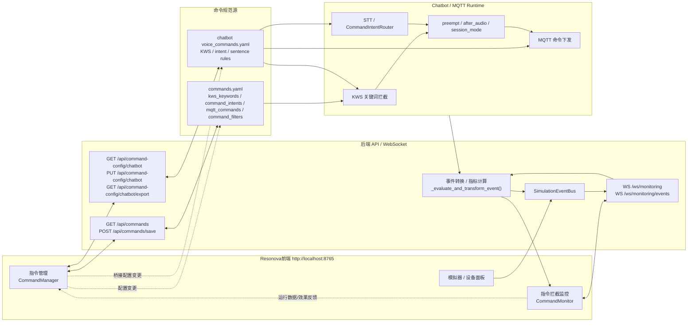

Turn-first reading note: command management is evaluated through turn-level command injection and turn-level outcomes, with session only as the lifecycle wrapper.

# 指令管理闭环

这份说明记录Resonova里“指令管理”和“指令拦截监控”如何构成一条闭环链路。

核心思想不是单纯做一个指令列表页面，而是把以下几层串起来：

- **规范源**：`backend/commands.yaml`
- **外部桥接**：`/api/command-config/chatbot` 直接读写 chatbot 的 `voice_commands.yaml`
- **管理面**：前端 `CommandManager`
- **观测面**：前端 `CommandMonitor`
- **事件层**：`SimulationEventBus` + `/ws/monitoring`
- **运行时**：chatbot / MQTT / KWS / STT / 事件广播

这样可以做到：

- 规则配置与运行观测解耦
- 配置修改可以回写到单一 source of truth
- 运行数据可以反哺规则评估
- 指令的启用、禁用、标注、优先级和效果统计都能逐步闭环

## 闭环图

## 各层职责

### 1. 指令管理

前端 `CommandManager` 负责管理四类平台配置：

- `kws_keywords`
- `command_intents`
- `mqtt_commands`
- `command_filters`

它不是普通列表页，而是面向命令规范的编辑器。

### 2. 指令拦截监控

前端 `CommandMonitor` 负责展示运行时事件：

- KWS 命中
- 指令检测
- MQTT 下发
- STT / LLM / TTS / moderation 链路事件

它的目标是观测效果，而不是直接编辑配置。

### 3. 后端事件层

`backend/server.py` 提供：

- `GET /api/commands`
- `POST /api/commands/save`
- `GET /api/command-config/chatbot`
- `PUT /api/command-config/chatbot`
- `GET /api/command-config/chatbot/export`
- `WS /ws/monitoring`
- `WS /ws/monitoring/events`

其中：

- `/api/commands` 管理Resonova本地的 `commands.yaml`
- `/api/command-config/chatbot` 直接桥接 chatbot 的 `voice_commands.yaml`

### 4. 运行时

chatbot 运行时从 YAML 读取规则，供：

- KWS 关键词命中
- STT 文本意图命中
- MQTT 命令下发

这保证了“管理面”和“运行面”虽然分离，但配置源保持一致。

## 这套模式支持什么

- 新增指令
- 禁用指令
- 调整规则优先级
- 给指令打标签
- 标注某条规则效果好或差
- 从运行数据里回看命中率和误拦截情况

## 当前约束

- Resonova本地 `commands.yaml` 仍然是平台自己的 source of truth
- chatbot 的 `voice_commands.yaml` 是另一条可外部管理的源
- 两者通过 `/api/command-config/chatbot` 这条桥接接口连接
- 运行时仍然依赖 YAML 文件，重启后重新读取

## 与 chatbot 项目的关系

`resonova` 和 `projects/chatbot` 是独立仓库，但通过以下几个点保持联动：

- MQTT 协议
- 配置 YAML
- 运行事件
- 指令效果反馈

最简单的集成方式就是：

1. 平台编辑 chatbot 兼容的 YAML 文件
2. 平台导出该文件
3. chatbot 从同一路径读取该文件
4. chatbot 重启后生效

## 相关文件

- `backend/commands.yaml`
- `backend/server.py`
- `backend/mqtt_bridge.py`
- `frontend/src/components/CommandManager.vue`
- `frontend/src/components/CommandMonitor.vue`
- `projects/chatbot/src/processors/intent/definitions/voice_commands.yaml`

