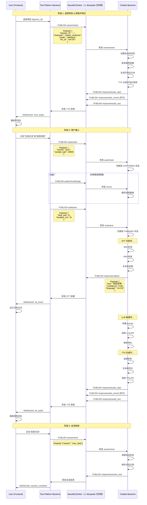

# 真实对话模式实现方案

## 🎯 目标

实现**完全真实的 chatbot 交互流程**，包括：

1. **选择角色** → 发送角色信息到 chatbot
2. **chatbot 返回开场白** → TTS 合成并播放
3. **用户输入**（生成对话或选择语音）→ 发送到 chatbot
4. **chatbot 响应** → STT + LLM + TTS 完整链路
5. **实时监听状态** → 显示 chatbot 的响应

---

## 📊 Chatbot 真实会话流程

### MQTT Topic 结构

```
# v1.1 协议
devices/{device_id}/request/session/{session_id}/start
devices/{device_id}/request/session/{session_id}/audio/start
devices/{device_id}/request/session/{session_id}/audio/chunk/{seq}
devices/{device_id}/request/session/{session_id}/audio/eos
devices/{device_id}/request/session/{session_id}/end

# Response topics（chatbot → device）
devices/{device_id}/response/session/{session_id}/vadeos
devices/{device_id}/response/session/{session_id}/audio/start
devices/{device_id}/response/session/{session_id}/audio/chunk/{seq}
devices/{device_id}/response/session/{session_id}/audio/eos
```

### 完整时序图



---

## 🔧 实现步骤

### 第 1 步：前端 - 选择角色时触发开场白

```typescript
// frontend/src/components/DeviceCard.vue

async function onFigurineChange(newFigurineId: string) {
  figurineId.value = newFigurineId
  
  if (mode.value === 'dialogue') {
    // 1. 加载角色的 TTS 音频历史
    await loadFigurineTTSAudios()
    
    // 2. 连接到 chatbot，获取开场白
    await connectToChatbotAndGetIntro(newFigurineId)
  }
}

async function connectToChatbotAndGetIntro(figurineId: string) {
  // 调用后端 API，启动与 chatbot 的真实连接
  const resp = await axios.post('/api/dialogue/connect', {
    figurine_id: figurineId,
    device_id: deviceId.value,
    mode: 'dialogue',
  })
  
  // 接收开场白音频
  const introAudioUrl = resp.data.intro_audio_url
  playAudio(introAudioUrl)
}
```

### 第 2 步：后端 - 处理角色连接请求

```python
# backend/server.py

@app.post("/api/dialogue/connect")
def connect_to_chatbot(req: DialogueConnectRequest):
    """连接到 chatbot，获取角色的开场白。"""
    
    # 1. 生成 session_id
    session_id = str(uuid.uuid4())
    
    # 2. 连接到 MQTT Broker
    mqtt_client = paho.mqtt.Client()
    mqtt_client.connect(MQTT_HOST, MQTT_PORT)
    
    # 3. 发布 session/start
    start_payload = {
        "session_id": session_id,
        "character": req.figurine_id,
        "mode": req.mode,
        "nfc_id": f"sim-{req.device_id}",
        "turn_proto": 1,
        "audio": {
            "format": "pcm",
            "sample_rate": 16000,
            "channels": 1,
            "bits_per_sample": 16,
        },
    }
    
    topic = f"devices/{req.device_id}/request/session/{session_id}/start"
    mqtt_client.publish(topic, json.dumps(start_payload), qos=1)
    
    # 4. 订阅 response topics
    response_topic = f"devices/{req.device_id}/response/session/{session_id}/#"
    mqtt_client.subscribe(response_topic)
    
    # 5. 等待开场白音频
    intro_chunks = []
    def on_message(client, userdata, msg):
        if "audio_chunk" in msg.topic:
            intro_chunks.append(msg.payload)
        elif "audio_eos" in msg.topic:
            # 收到 EOS，拼接音频
            intro_audio = b"".join(intro_chunks)
            # 保存到临时文件
            intro_path = save_intro_audio(intro_audio, session_id)
            userdata["intro_path"] = intro_path
    
    mqtt_client.on_message = on_message
    mqtt_client.user_data_set({})
    
    # 等待最多 5 秒
    for _ in range(50):
        mqtt_client.loop(timeout=0.1)
        if "intro_path" in mqtt_client.user_data():
            break
    
    intro_path = mqtt_client.user_data().get("intro_path", "")
    
    return {
        "session_id": session_id,
        "intro_audio_url": f"/api/dialogue/intro/{session_id}",
    }
```

### 第 3 步：用户输入 - 发送音频到 chatbot

```typescript
// frontend/src/composables/useDialogue.ts

async function sendUserInput(audioBlob: Blob) {
  // 1. 将音频转换为 PCM
  const pcmData = await convertToPCM(audioBlob)
  
  // 2. 通过 WebSocket 发送到后端
  ws.send(JSON.stringify({
    type: 'user_input',
    audio_data: base64Encode(pcmData),
  }))
}
```

```python
# backend/server.py - WebSocket handler

@app.websocket("/ws/dialogue/{session_id}")
async def dialogue_websocket(websocket: WebSocket, session_id: str):
    await websocket.accept()
    
    mqtt_client = create_mqtt_client_for_session(session_id)
    
    try:
        while True:
            data = await websocket.receive_json()
            
            if data['type'] == 'user_input':
                # 解码音频
                pcm_data = base64Decode(data['audio_data'])
                
                # 分帧发送
                await send_audio_to_chatbot(mqtt_client, session_id, pcm_data)
                
    finally:
        mqtt_client.disconnect()

async def send_audio_to_chatbot(mqtt_client, session_id: str, pcm_data: bytes):
    """发送音频到 chatbot。"""
    
    # 1. 发布 audio/start
    start_payload = {
        "format": "pcm",
        "sample_rate": 16000,
        "channels": 1,
    }
    mqtt_client.publish(
        f"devices/sim-dev/request/session/{session_id}/audio/start",
        json.dumps(start_payload),
        qos=1,
    )
    
    # 2. 分帧发送 chunk
    frame_size = 2560  # 160ms @ 16kHz
    seq = 1
    for i in range(0, len(pcm_data), frame_size):
        chunk = pcm_data[i:i+frame_size]
        mqtt_client.publish(
            f"devices/sim-dev/request/session/{session_id}/audio/chunk/{seq}",
            chunk,
            qos=0,
        )
        seq += 1
        await asyncio.sleep(0.01)  # 模拟实时流
    
    # 3. 发布 audio/eos
    duration_ms = int(len(pcm_data) / 2 / 16000 * 1000)
    eos_payload = {
        "total_seq": seq - 1,
        "duration_ms": duration_ms,
    }
    mqtt_client.publish(
        f"devices/sim-dev/request/session/{session_id}/audio/eos",
        json.dumps(eos_payload),
        qos=1,
    )
```

### 第 4 步：接收 chatbot 响应

```python
# backend/server.py

def setup_response_listener(mqtt_client, session_id: str, websocket: WebSocket):
    """设置响应监听器。"""
    
    def on_message(client, userdata, msg):
        topic = msg.topic
        
        if "vadeos" in topic:
            # STT 结果
            payload = json.loads(msg.payload)
            asyncio.run_coroutine_threadsafe(
                websocket.send_json({
                    "type": "stt_result",
                    "text": payload.get("text", ""),
                    "confidence": payload.get("confidence", 0),
                }),
                asyncio.get_event_loop(),
            )
        
        elif "audio_start" in topic:
            asyncio.run_coroutine_threadsafe(
                websocket.send_json({"type": "tts_start"}),
                asyncio.get_event_loop(),
            )
        
        elif "audio_chunk" in topic:
            asyncio.run_coroutine_threadsafe(
                websocket.send_json({
                    "type": "tts_chunk",
                    "data": base64.b64encode(msg.payload).decode(),
                }),
                asyncio.get_event_loop(),
            )
        
        elif "audio_eos" in topic:
            asyncio.run_coroutine_threadsafe(
                websocket.send_json({"type": "tts_end"}),
                asyncio.get_event_loop(),
            )
    
    mqtt_client.on_message = on_message
    mqtt_client.subscribe(f"devices/sim-dev/response/session/{session_id}/#")
```

---

## 📝 关键配置

### 环境变量

```bash
# .env

# MQTT Broker
MQTT_HOST=localhost          # WSL 中的 NanoMQ（⚠️ Mosquitto 已弃用）
MQTT_PORT=1883

# Chatbot 配置
CHATBOT_DEVICE_ID=sim-dev-001
CHATBOT_BASE_TOPIC=devices/{device_id}
```

### MQTT Topics 映射

```python
# backend/mqtt_topics.py

class MQTTTopics:
    """MQTT Topic 常量。"""
    
    @staticmethod
    def session_start(device_id: str, session_id: str) -> str:
        return f"devices/{device_id}/request/session/{session_id}/start"
    
    @staticmethod
    def audio_start(device_id: str, session_id: str) -> str:
        return f"devices/{device_id}/request/session/{session_id}/audio/start"
    
    @staticmethod
    def audio_chunk(device_id: str, session_id: str, seq: int) -> str:
        return f"devices/{device_id}/request/session/{session_id}/audio/chunk/{seq}"
    
    @staticmethod
    def audio_eos(device_id: str, session_id: str) -> str:
        return f"devices/{device_id}/request/session/{session_id}/audio/eos"
    
    @staticmethod
    def session_end(device_id: str, session_id: str) -> str:
        return f"devices/{device_id}/request/session/{session_id}/end"
    
    @staticmethod
    def response_pattern(device_id: str, session_id: str) -> str:
        return f"devices/{device_id}/response/session/{session_id}/#"
```

---

## 🎯 当前阶段 vs 未来阶段

### 当前阶段（基础真实全链）

✅ **已实现**：
- 真实 MQTT 协议通信
- 完整的 session 生命周期
- STT/TTS 音频传输

🎯 **待实现**：
- [ ] 选择角色时自动获取开场白
- [ ] 开场白自动播放
- [ ] 用户输入直接发送到 chatbot
- [ ] 实时显示 chatbot 响应

### 未来阶段（源码级监控）

- Hook 注入 chatbot 源码
- 实时监控每个处理步骤
- 性能分析和瓶颈检测

---

## 🚀 下一步行动

1. **实现 `/api/dialogue/connect` 端点**
   - 连接到 chatbot
   - 获取开场白
   - 返回音频 URL

2. **实现 WebSocket 双向通信**
   - 前端发送用户输入
   - 后端转发到 chatbot
   - 接收并推送 chatbot 响应

3. **前端 UI 更新**
   - 选择角色后自动播放开场白
   - 添加"发送"按钮
   - 显示实时对话历史

4. **测试完整流程**
   - 选择角色 → 播放开场白
   - 输入文本 → 发送到 chatbot
   - 接收响应 → 播放 TTS
